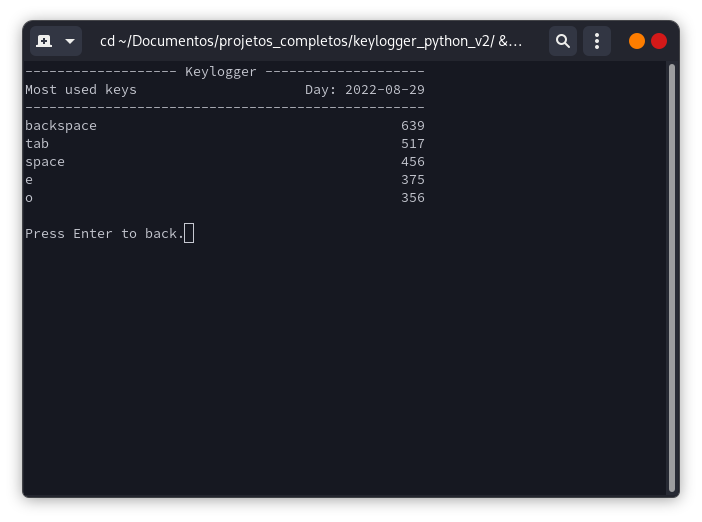
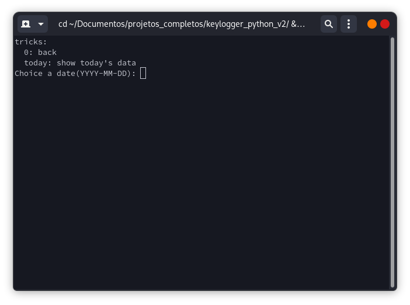
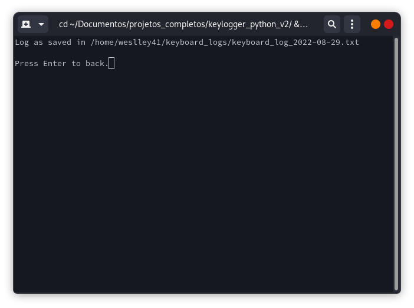

# Keylogger ⌨️

Por curiosidade, eu queria saber o quanto uso o teclado diariamente. Então criei um script python utilizando algumas bibliotecas, enquanto em execução ele registra a quantidade de vezes que a uma tecla é pressionada.

## 📖 Sumário
- [Descrição](#-descrição)
	- [Keylogger CLI](#keylogger-cli)
- [Configurações](#configurações)
	- [Extra](#atalho-para-o-keylogger-cli)

## 🔍 Descrição
Enquanto o programa está sendo executado ele faz a leitura de todas as teclas usadas e contabiliza em um banco de dados mysql local. Os scripts foram feitos majoritariamente em Python, com exceção do arquivo de auto configuração que utiliza ShellScript.

### Keylogger cli
O keylogger cli é um script onde você pode ver as estatísticas de uso, como: teclas mais utilizadas, gerar um arquivo de log ou exibir um gráfico de uso semanal.
Para pegar os dados do banco de dados o script se conecta à uma api (também rodando localmente).

⭐ Menu principal


🏅 Mostra as teclas mais utilizadas



📜 Arquivos de logs





`Exemplo de log`
```
------------------- Keylogger --------------------
Log file                           Day: 2022-08-29
--------------------------------------------------
backspace                                      640
tab                                            517
space                                          456
e                                              375
o                                              357
a                                              314
enter                                          298
alt                                            281
t                                              265
ctrl                                           248
...
```

📊 Gráfico semanal


## Configurações
Para fazer a configuração você precisa ter instalado a versão 3.10 do Python, o pipenv e um servidor mysql rodando. Com isso basta executar o arquivo 'bin/autoconfig.sh' e preencher os campos necessários para configurar os serviços locais.

`
chmod +x bin/autoconfig.sh
./bin/autoconfig.sh
`

Se tudo ocorrer bem, seu keylogger estará funcionando.

### Atalho para o Keylogger cli
Quanto ao keylogger cli, você pode criar um atalho para ele usando o `alias`, por exemplo:

`alias keylogger_cli="python path/to/keylogger_python/bin/keylogger_cli.py"`

Se você não conhece vale a pena dar uma pesquisada sobre os [alias](https://wiki.manjaro.org/index.php/Aliases_in_.bashrc).
