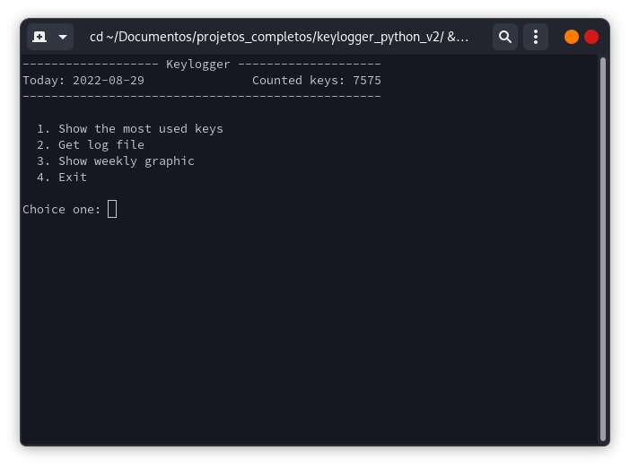
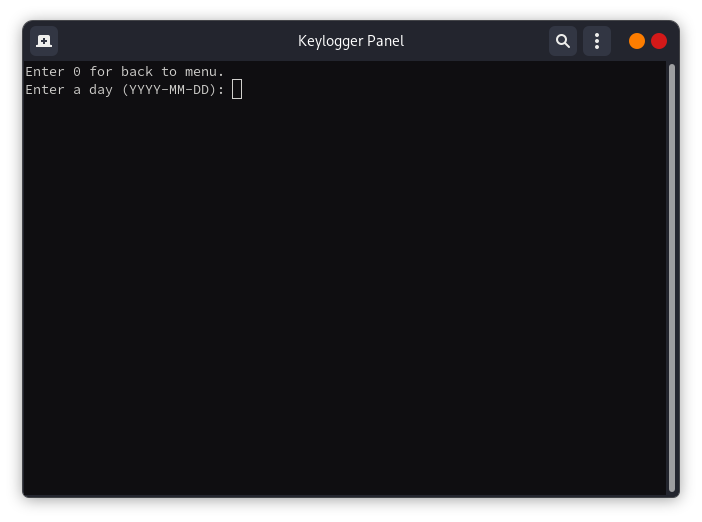
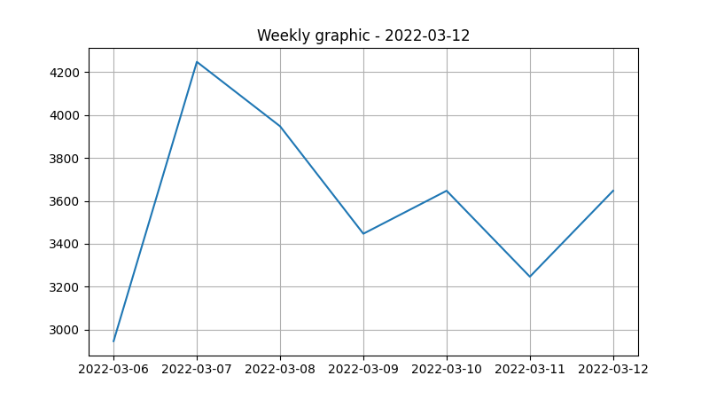

# Keylogger ⌨️

🇧🇷 Certo dia me bateu uma dúvida do quanto eu uso o teclado num dia, então procurei criar um script em python que contasse todas as teclas pressionadas para que eu pudesse visualizar estes dados mais tarde.

🇺🇸 I wanted know how much use the keyboard, then i created a program to read all used keys, to see the data later.

## 📖 Summary
- [Description](#-description)
- [Settings](#%EF%B8%8F-settings)
    - [Requirements](#requirements)
    - [Autostart](#run-on-startup)

## 🔍 Description
🇧🇷 Enquanto o programa está sendo executado ele faz a leitura de todas as teclas usadas e contabiliza em um arquivo json, tanto a quantidade de vezes de uso da tecla pressionada quanto a contagem geral de teclas.

🇺🇸 While the program stay running, he read all used keys and make a counts in json file.

### Central Panel
🇧🇷 No painel de controle é possível ver as teclas mais utilizadas no dia e gerar logs de dias específicos, também há um gráfico semanal.

🇺🇸 In central panel it's possible see the most used keys and generate logs of last days and also a weekly graphic.

⭐ Menu principal - Main menu



🏅 Mostra o ranking de teclas - Show top keys


📜 Arquivos de logs - Get logs




`Exemplo de log - Log example`
```
Day: 2022-03-12
Keys pressed: 3507

    Key    |  Count   
enter      |   288
backspace  |   218
tab        |   205
left       |   187
up         |   148
e          |   146
alt        |   133
space      |   130
ctrl       |   128
...
```

📊 Gráfico semanal - Weekly graphic


🇧🇷 Apenas um exemplo, os dados são falsos.

🇺🇸 Only a example, data not true.

## 🛠️ Settings
🇧🇷 Para iniciar o programa basta rodar o arquivo `run.py` com permissão de administrador.

🇧🇷 E para acessar o painel de controle execute o arquivo `central_panel.py`

🇺🇸 Execute `run.py` with admin permission to start the program.

🇺🇸 For access the control panel, execute `central_panel.py`

## Requirements
🇧🇷 Para o gerar as registros de teclas será necessário apenas da biblioteca [keyboard](https://pypi.org/project/keyboard/).

🇧🇷 Para gerar o gráfico semanal precisará instalar a biblioteca [matplotlib](https://pypi.org/project/matplotlib/).

🇧🇷 Para ter acesso à todos os recursos basta executar

`pip install -r requirements.txt`

🇺🇸 For read the keyboard you need install: [keyboard](https://pypi.org/project/keyboard/).

🇺🇸 For generate weekly graphic you need install: [matplotlib](https://pypi.org/project/matplotlib/).

🇺🇸 For get full access:

`pip install -r requirements.txt`

## Autostart
### Run on startup
🇧🇷 No linux a maneira que eu encontrei para deixar o programa sempre em execução (sem precisar fazer nada ao iniciar o computador) foi criando um novo serviço no sistema.

🇺🇸 In linux i created a new service in systemd for execute the keylogger on startup system.

🇧🇷 Primeiro, criei um script `start_keylogger.sh` para executar o programa python.

🇺🇸 First, i created a script `start_keylogger.sh` to start the python program.

```
path=/path/to/file.py

exec sudo python $path & exit &
```

🇧🇷 e dei permissão de execução para ele com:

🇺🇸 Give execution permission:

```
chmod +x start_keylogger.sh
```

🇧🇷 Para criar um serviço precisei compilar este script para um executável linux, para isso utilizei o [shc](https://github.com/neurobin/shc) e movi o executável para a pasta de executáveis `/bin/`

🇺🇸 To create a service, i needed compile a shell script using the [shc](https://github.com/neurobin/shc) and move the result to `/bin/`

```
shc -f start_keylogger.sh -o keylogger
sudo mv keylogger /bin/
```

🇧🇷 Link adicional sobre o tópico

🇺🇸 Additional link about the topic

https://tecadmin.net/create-binary-file-from-shell-script/

🇧🇷 Agora sim, criando o serviço para deixar o programa sempre em execução. Crie um arquivo em `/etc/systemd/system/`, vou chamá-lo de `keylogger.service`, deixei assim:

🇺🇸 Finally, creating the service. Create a file in `/etc/systemd/system/`, i called it `keylogger.service`, my result:

```
[Unit]
Description=Keylogger

[Service]
RemainAfterExit=yes
User=root
ExecStart=/bin/keylogger

[Install]
WantedBy=multi-user.target
```

🇧🇷 Habilite e execute o serviço.

🇺🇸 Enable and start the service.

```
systemctl enable keylogger.service
systemctl start keylogger.service
```

🇧🇷 Link adicional sobre o tópico

🇺🇸 Additional link about the topic

https://stackoverflow.com/a/60658442

### Shortcut for central panel
🇧🇷 Quanto ao painel de controle, no linux você pode criar um atalho para ele usando o `alias`, por exemplo:

🇺🇸 For the control panel, in linux you can create a shortcut using the `alias`, example:

`alias keylogger_panel="python ~/keylogger_python/central_panel.py"`

🇧🇷 Se você não conhece vale a pena dar uma pesquisada sobre os [alias](https://wiki.manjaro.org/index.php/Aliases_in_.bashrc).

🇺🇸 If you want, can search more about [alias](https://wiki.manjaro.org/index.php/Aliases_in_.bashrc).
